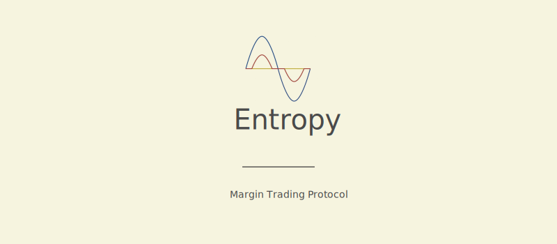

## Contents

- [An Introduction to Margin Trading](./spec/introduction.md)
- [Margin Accounts](./spec/margin.md)
- [Lending Pool](./spec/lending.md)
- [Flow Diagrams](./spec/flow.md)
- [Insurance](./spec/insurnace.md)
- [Liquidation](./spec/liquidation.md)
- [Staking](./spec/staking/md)
- [Governannce](./spec/governance.md)

## Overview

Entropy is a protocol that enables the trading of currencies supported by the [token swap program](https://spl.solana.com/token-swap) on margin. This protocol allows traders to leverage their tokens to amplify their gains or losses, while providing interest to liquidity providers.

In this margin trade, a trader puts collateral into an obligation account and borrows a leveraged amount of the opposite token through a modified [token lending program](https://github.com/solana-labs/solana-program-library/tree/master/token-lending), which is immediately swapped through the token swap/DEX program into the collateral denomination. This enables traders to leverage their positions of any token pair that can be swapped on chain.

The trader can increase the amount of leverage, which increases the amount borrowed and swapped, but means the position can be liquidated if the price drops by a smaller amount. Liquidation can be triggered by any user on the network once the collateral and swapped tokens drops below the amount needed to swap and repay the loan with interest after slippage.

The protocol includes lending pools, margin accounts, liquidation bots, an insurance fund and finally a governance mechanism. This is all wrapped up in a UI designed for ease of use.
