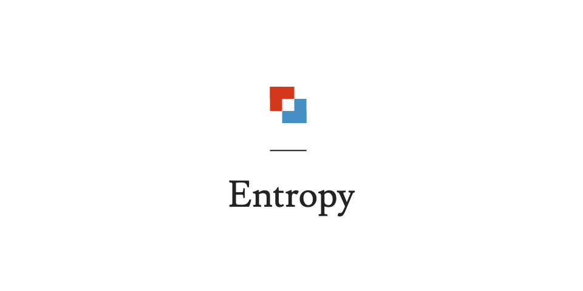

A Margin Trading Protocol on Solana.

## Contents

- [An Introduction to Margin Trading](./spec/introduction.md)
- [Margin Accounts](./spec/margin.md)
- [Lending Pool](./spec/lending.md)
- [Insurance](./spec/insurnace.md)
- [liquidation](./spec/liquidation.md)
- [Staking](./spec/staking/md)
- [Governannce](./spec/governance.md)

## Overview

Entropy is a protocol that enables the trading of currencies supported by the Serum DEX on margin. It enables traders to open a specific margin account and stake underlying equity as collateral in order to further leverage or diversify regular positions in the market. It includes lending pools, liquidation bots, an insurance fund and finally a governance mechanism. This is all wrapped up in a UI designed for ease of use.
