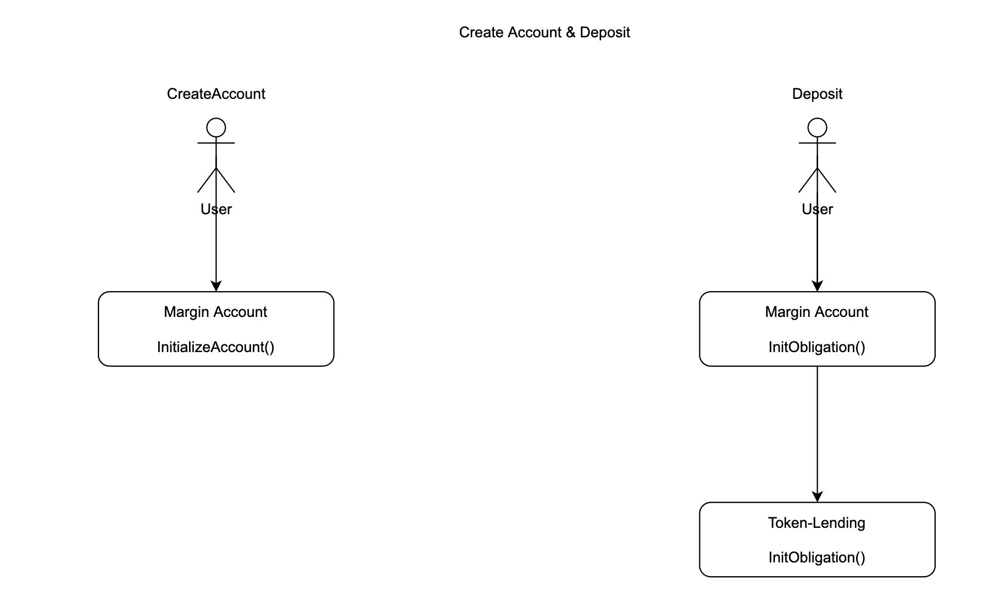
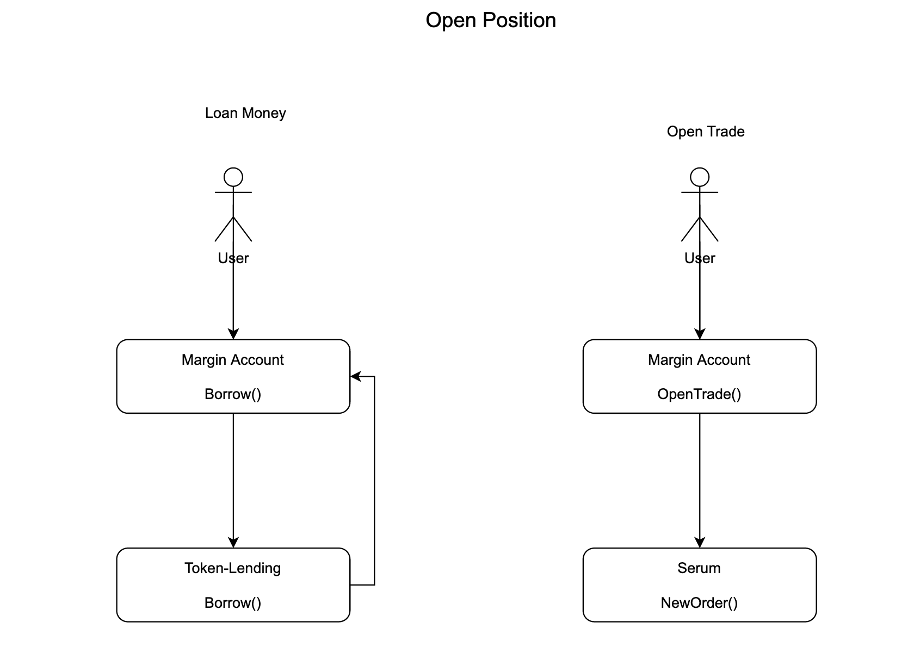
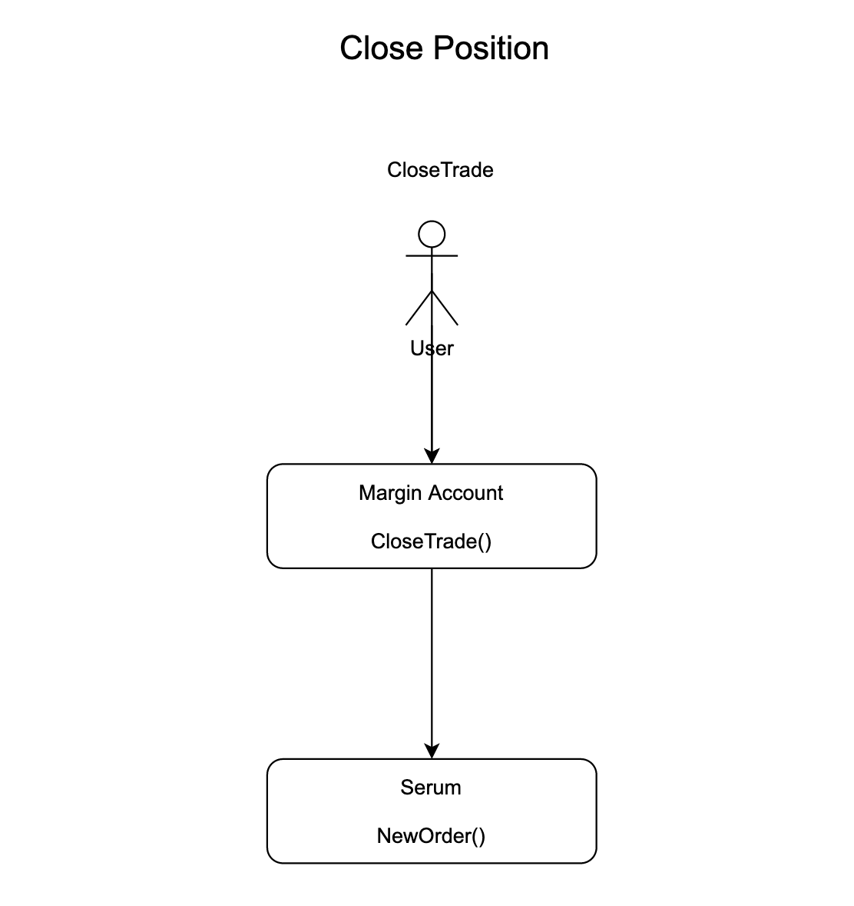
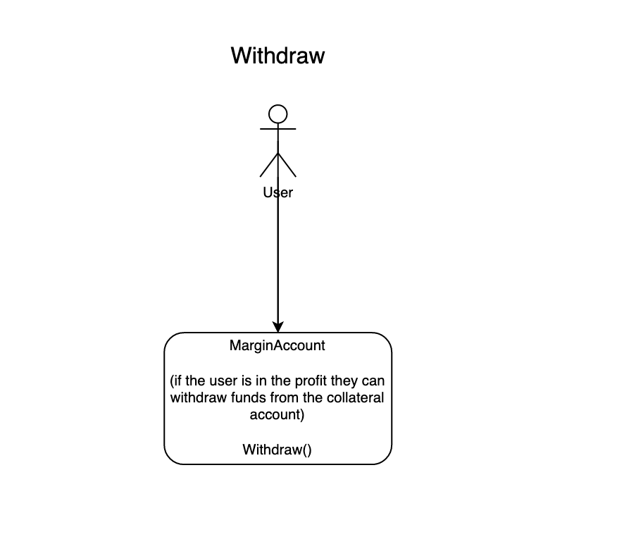
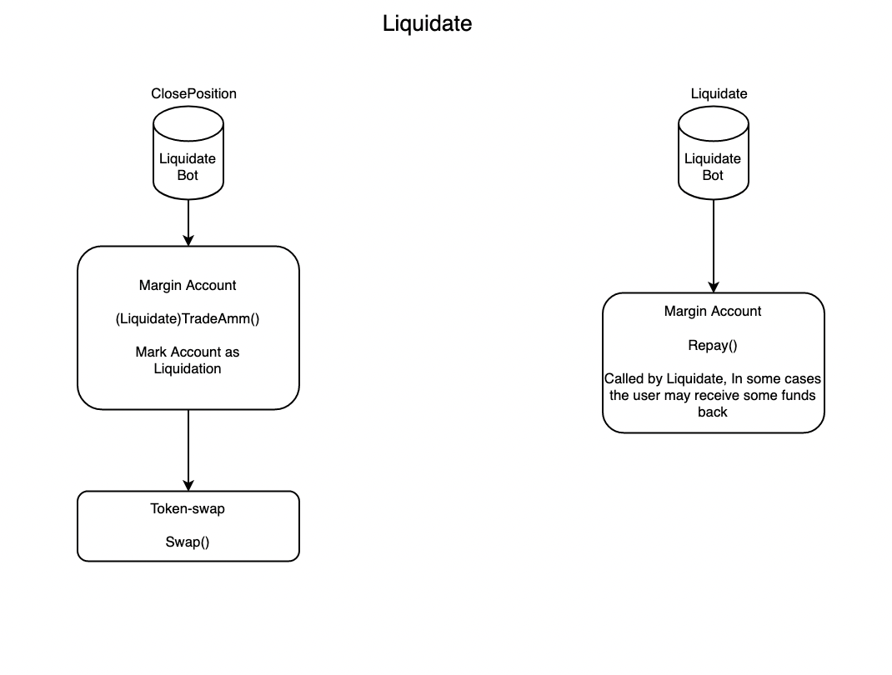

# Flow

This document describes the contract flows grouped by how they will be called by clients. 

- How to read the images?

Each flow transaction starts from a user or liquidation bot. The farthest left is the first transaction followed by the next one in the row. 

## Create Account

A user creates an account and deposits funds into the obligation account. 

## Open

Open starts with a user setting a leverage level, borrows the funds needed, then creates a new order. At this stage the account is marked as having an open trade, prohibiting an withdrawals until the loan has been repaid in full with interest. 

## Close

Close begins with first swapping the tokens in the margin account to repay the loan with interest. Then, the swapped tokens are repaid to the liquidity provider.

<TODO Update flow>

## Withdraw

Withdraw is called by the trader, allowing them to withdraw the funds put into an obligation account.

<TODO Update flow>

## Liquidate

When an open trade is not making a profit it will be losing money. At a certain threshold, decided by the protocol, a liquidation bot will notice the account reaching a point where the collateral will not be enough. At this time it will begin the liquidation process, which sells off some of the obligation in order to repay the loan. 

